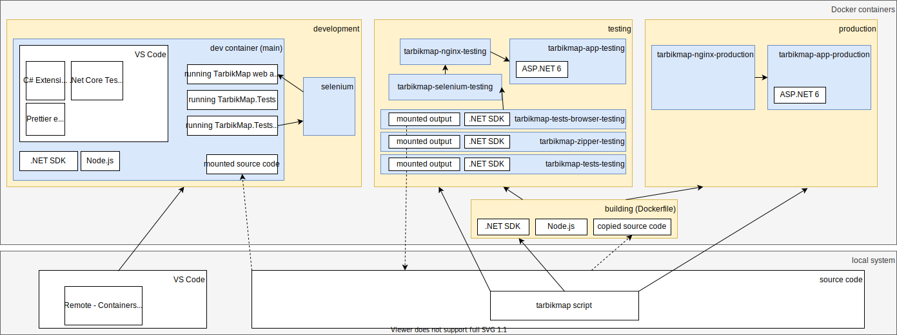

# Tarbik Map

Game for 1 to 20 players about guessing locations on a map. The player with the nearest guess gets the most points.


## Configuration:

- some game types use external APIs - specify your API keys in **TarbikMap/config/production/private/values.json**
- to modify map style (e.g. to use tiles supporting more zoom levels), change **TarbikMap/config/production/public/style_example.json** (or point to another style file in **TarbikMap/config/production/public/styles.json**)
- after changing map style to get map resources from a different location, you can disable ServeMapResources in **TarbikMap/config/production/private/values.json**

## Building

Prepare:

- Linux
- Bash
- Docker

```
git clone https://github.com/milan11/tarbikmap.git
cd tarbikmap
./tarbikmap build
./tarbikmap start
```

Access: https://localhost:38443

```
./tarbikmap stop
```

Use files in outputs/zip to deploy the web application e.g. to Microsoft Azure App Service.

## Development

- server-side is implemented in ASP.NET Core (C#)
- client-side is implemented in React (TypeScript)
- for everything, use Visual Studio Code with Remote - Containers extension
- in Visual Studio Code, choose Reopen in Container when prompted

## Architecture


